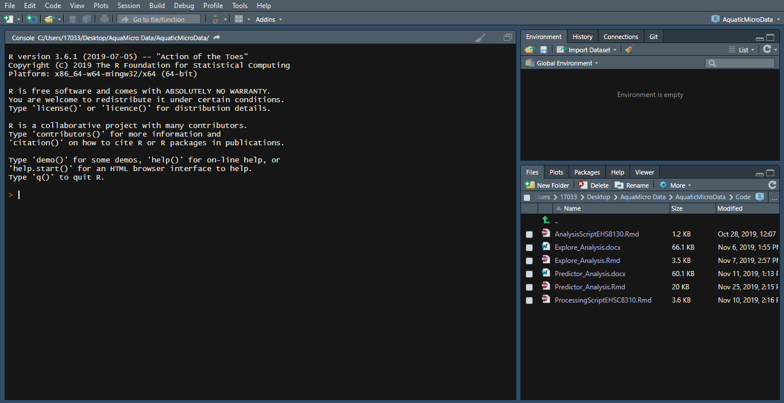
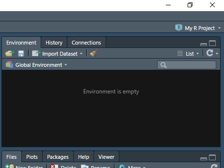
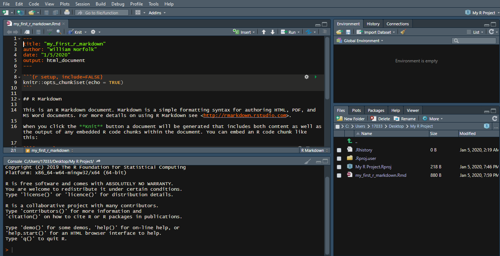
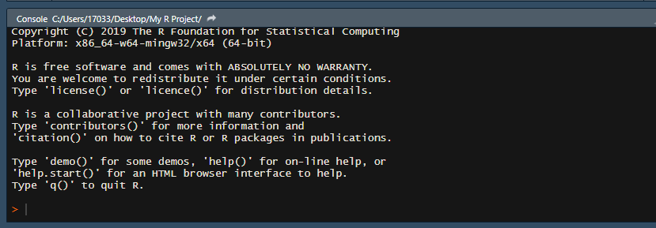
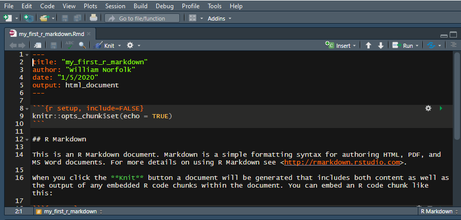
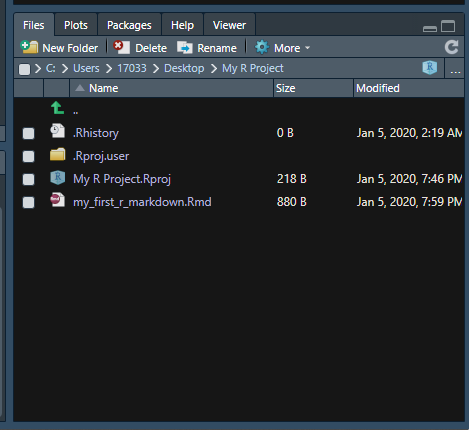

## Welcome to Intro to R Training 

The purpose of this training is to guide you through the download/installation of R, Rstudio, and Pandoc as well a a breif crash course in some of the functioniality of the program for data organization/visualization.  

To start we will download all required programs to run R readily from your personal computer. Note this tutorial will utlize Rstudio which is a set of integrated tools designed to make the usage of R more user friendly.  

_Lets Get Started!_

## Download R

First and foremost you must download R.

1. R can be downloaded at [this link](https://www.r-project.org/).  
2. Follow the **download R** link in the first paragraph of text.  
_You can select any CRAN mirror you like, just ensure it is a USA version and newer than 3.5.   (This script was developed under the Duke University mirrior)._  
3. Select the approproate download for your computer type: i.e. Windows or Mac. 

## Download Rstudio 

Next you will need to download Rstudio Desktop.

1. Rstudio Desktop can be downloaded at [this link](https://rstudio.com/products/rstudio/download/).  
_The select free version._

## Download Pandoc

Lastly, you will need to download Pandoc. Pandoc is a program that will convert your script to a Word Document. This is very helpful for quickly transferring figures and tables from Rstudio to documents and/or presentations. _Note_ Pandoc does not always directly retain the formatting from Rstudio so additional modification may be needed to size visuals properly for documents. 

1. The latest version of Pandoc can be downloaded at [this link](https://pandoc.org/installing.html).  
_Now we are ready to get started!_

# Getting to Know Rstudio

Now that we have everything installed it is time to open up Rstudio.

You should see a three-paned screen that looks similar to the image below:  
_Do not worry if you screen is a different color (I will show you how to change this later if desired). Additionally, do not worry about the file names listed in the bottom right pane (these will change based on your own computer)._  

```{r openscreen, out.height = "100%", out.width = "100%", echo=FALSE}
 
```

## Creating a New R Project and Script

Before we delve into the function of each of the screens lets create a project that will serve as a base for your R tutorial.  
Follow the steps below:  

1. On your computer create a **new folder** on your desktop.   
    - When using Rstudio you will create _scripts_ which will be saved onto your computer (similar to the way word documents or pictures are saved). We will use this folder to save your R project as well as any accompanying scripts. 
    - Throughout this tutorial the file folder will be titled _My R Project_ (any name is appropriate however).
    
2. In Rstudio select **File**, **New Project**, **Existing Directory**, then select the _new folder_ you created in step 1.  
    - This will create a new R project in your new folder. R projects are indicated by a blue cube icon.
    - It is best to give your R files easy to identify names (i.e. avoid the usage of special characters and excessive capatilization).
    - A new Rstudio session should open your newly created R project. If your project does not open simply double click the project file _(indicated by the blue cube icon)_ to open.
    - To check which project you have open _(if any)_ in Rstudio look to the upper right-hand corner of your screen. You will see the R project cube icon with the name of the project. The image below shows an opened R project titled _My R Project_.
    
```{r proj view, out.height = "100%", out.width = "100%", echo=FALSE}
 
```
    
3. Next, we will create a new R script. In you Rstudio session _(with your project open)_ select **File**, **New File**, and **R Markdown**. Give the markdown any name you would like and select **Word** as your output. For this example, our markdown file will be called _my_first_r_markdown_. 
    - There are many different types of R scripts you can use for your analysis needs all of which have different applications. For this tutorial we will focus entirely on **Markdown or (.Rmd)** files due to their ease of understanding and ability to write extensive commentary.
    
4. Lastly, you must save your new file. Select **File** then **Save As**. Save the Markdown file with the same title you gave to the file in Rstudio (for this example I used _my_first_r_markdown_).
    - If everything was done correctly you should now see a four-paned Rstudio window that looks as below:  

```{r fourpanes, out.height = "100%", out.width = "100%", echo=FALSE}
 
```

## The Four Rstudio Windows

Now that you are setup and ready to work in Rstudio it is first important to learn the functionality of each of the four windows. 

## The Console (bottom left)

The console is the bottom left window of your Rstudio screen and appears as below:

```{r console, out.height = "100%", out.width = "100%", echo=FALSE}
 
```

The console is the buisness end of Rstudio. All computation, functions, commands, etc. run through the console to preform the specific task they acomplish. You can type commands **directly** into the console or you can **feed** the console commands from your script tab (see below) when runing your code. 

<style>
div.blue { background-color:#e6f0ff; border-radius: 5px; padding: 20px;}
</style>
<div class = "blue">

**Try It!**  
In the console try a simple math equation such as 2 + 2.  
All direct typing into the console will start behind the **>** symbol located at the bottom left of the screen.
</div>

The console is an extremely useful tool when working in Rstudio. While you are unlikely to perform a large amount of coding directly into the console, this functionality is very helpful when troubleshooting/syntax testing to ensure your code is functional before directly entering it into your working script. 

The console also will save a history of all of the commands you have previously run in the program. This is helpful when attempting to backtrack and/or reuse code from a previous part of your analysis. _Simply scroll up and down in the console to see all previous commands_.

## The Script Tab (top left)

While this console is the computational powerhouse of Rstudio, the script tab is the instruction manual for your R analysis. The script tab looks as below:  

```{r script tab, out.height = "100%", out.width = "100%", echo=FALSE}
 
```

The script tab is where you will view all of your actively open R scripts. R scripts are similar to word documents in the fact that you type, modify, and save changes to the files in a similar manner however; scripts will contain a combination of plain text and coding information that allow Rstudio to perform the desired analysis tasks while also providing space for commentary. 

As mentioned above, this tutorial will be using a **Markdown** type of R script. You can think of a markdown as word document with _"chunks"_ of R code embedded into the text. Code "chunks" in markdown files will always start and end with three backticks **(```)**. All content **between** the two sets of backticks will be interpreted as code in Rstudio. These allow you to write detailed commentary to accompany specific coding aspects of your analysis for future reference. _This tutorial was created using an R Markdown script as well!_

As you complete portions of your analysis in your script tab you can click the **Run** button at the upper right of the script tab to run all or some of your script. When you run all/portions of code from your script tab you will see the commands appear in the console. Markdown files will show you the results of you code both below the specific code chunk, as well as in the console. 

<style>
div.blue { background-color:#e6f0ff; border-radius: 5px; padding: 20px;}
</style>
<div class = "blue">

**Try It!**  
In the script tab try the same math equation you ran in the console from above.  

Delete the text ```knitr::opts_chunk$set(echo = TRUE)``` from the first code chunk in the example and replace it with the math equation.  

To run the code chunk you can click the **Run** button in the upper right of the script tab or simply click the **green play** button located in the upper right hand corner of code chunk. The play button will only run the code from that specific chunk. 
</div>

We will go into a few more details of Markdown scripts a bit later on when we begin coding. 

## The Global Environment (top right)

The remaining two panes of the Rstudio screen are support components of the program. The global environment allows you to track all objects, equations, datasets, etc. that you have loaded into R or created while coding. This window looks as below:  

```{r global environ 2, out.height = "100%", out.width = "100%", echo=FALSE}
 
```

We will cover the details of the items in the coding introduction below, for now know that this pane is where these items will be stored for reference while conducting analysis. _We have not done any analysis as of yet so your global envrionment should be empty._ 

## The file Viewer (bottom right)

The last pane of the Rstudio screen is the file viewer and should look as below: 

```{r file viewer, out.height = "100%", out.width = "100%", echo=FALSE}
 
```

The file viewer allows you to view/navigate all files and folders that are currently in use by Rstudio. Since we created a new folder and R project in the early steps of this tutorial you shoud see a file view that is similar to the image above (assuming you have not added any new files since screating this folder). Think of the file viewer as a system similar to the File Explorer (Windows) or Finder (Mac). The files viewable here should be duplicates of the files you have saved directly onto your computer. 

In addition to the file viewer note the **additional tabs** in this window pane. Toggling these tabs you can switch between the **plot viewer** (this will display plots generated in the console), the **packages list** (this will list all installed and active packages in use), the **help tab** (this will display help pages for specific commands when prompted), and the **viewer tab** (this is used to view local web content). 

<style>
div.blue { background-color:#e6f0ff; border-radius: 5px; padding: 20px;}
</style>
<div class = "blue">

**Try It!**  
Toggle your file viewer to the **Packages** tab to view the packages library.     
You should see a number of listed packages that are installed (these are intrinsic to base R) usage of each package will be indicated by the presence or absence of a check mark.
</div>

