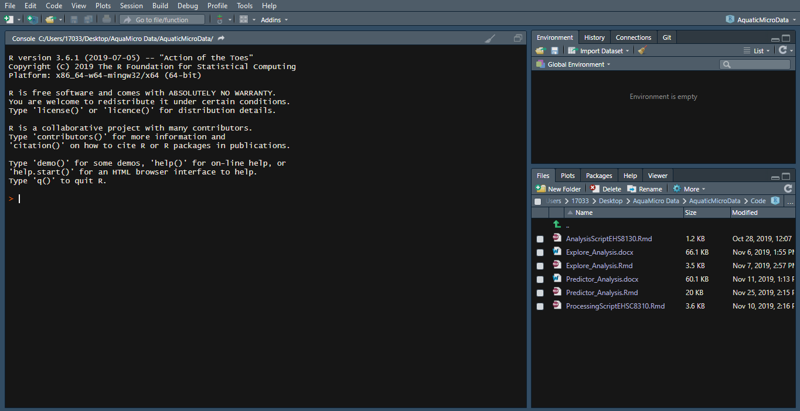
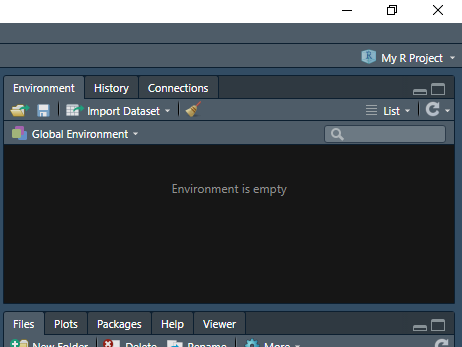
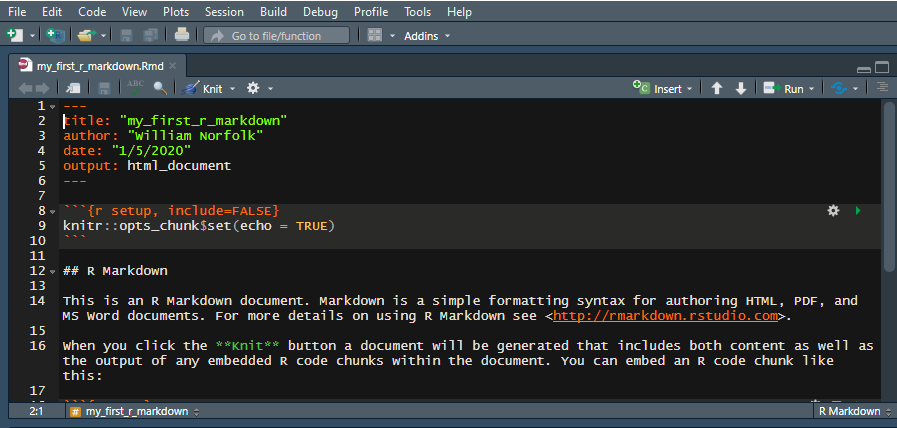

## Welcome to Intro to R Training 

The purpose of this training is to guide you through the download/installation of R, Rstudio, and Pandoc as well as a brief crash course in some of the functioniality of the program for data organization/visualization.  

To start we will download all required programs to run R readily from your personal computer. Note this tutorial will utlize Rstudio which is a set of integrated tools designed to make the usage of R more user friendly.  

_Lets Get Started!_

## Download R

First and foremost you must download R.

1. R can be downloaded at [this link](https://www.r-project.org/).  
2. Follow the **download R** link in the first paragraph of text.  
_You can select any CRAN mirror you like, just ensure it is a USA version and newer than 3.5.   (This script was developed under the Duke University mirrior)._  
3. Select the approproate download for your computer type: i.e. Windows or Mac. 

## Download Rstudio 

Next you will need to download Rstudio Desktop.

1. Rstudio Desktop can be downloaded at [this link](https://rstudio.com/products/rstudio/download/).  
_The select free version._

## Download Pandoc

Lastly, you will need to download Pandoc. Pandoc is a program that will convert your script to a Word Document. This is very helpful for quickly transferring figures and tables from Rstudio to documents and/or presentations. _Note_ Pandoc does not always directly retain the formatting from Rstudio so additional modification may be needed to size visuals properly for documents. 

1. The latest version of Pandoc can be downloaded at [this link](https://pandoc.org/installing.html).  
_Now we are ready to get started!_

# Getting to Know Rstudio

Now that we have everything installed it is time to open up Rstudio.

You should see a three-paned screen that looks similar to the image below:  
_Do not worry if you screen is a different color (I will show you how to change this later if desired). Additionally, do not worry about the file names listed in the bottom right pane (these will change based on your own computer)._  

```{r openscreen, out.height = "100%", out.width = "100%", echo=FALSE}
 
```

## Creating a New R Project and Script

Before we delve into the function of each of the screens lets create a project that will serve as a base for your R tutorial.  
Follow the steps below:  

1. On your computer create a **new folder** on your desktop.   
    - When using Rstudio you will create _scripts_ which will be saved onto your computer (similar to the way word documents or pictures are saved). We will use this folder to save your R project as well as any accompanying scripts. 
    - Throughout this tutorial the file folder will be titled _My R Project_ (any name is appropriate however).
    
2. In Rstudio select **File**, **New Project**, **Existing Directory**, then select the _new folder_ you created in step 1.  
    - This will create a new R project in your new folder. R projects are indicated by a blue cube icon.
    - It is best to give your R files easy to identify names (i.e. avoid the usage of special characters and excessive capatilization).
    - A new Rstudio session should open your newly created R project. If your project does not open simply double click the project file _(indicated by the blue cube icon)_ to open.
    - To check which project you have open _(if any)_ in Rstudio look to the upper right-hand corner of your screen. You will see the R project cube icon with the name of the project. The image below shows an opened R project titled _My R Project_.
    
```{r proj view, out.height = "100%", out.width = "100%", echo=FALSE}
 
```
    
3. Next, we will create a new R script. In you Rstudio session _(with your project open)_ select **File**, **New File**, and **R Markdown**. Give the markdown any name you would like and select **Word** as your output. For this example, our markdown file will be called _my_first_r_markdown_. 
    - There are many different types of R scripts you can use for your analysis needs all of which have different applications. For this tutorial we will focus entirely on **Markdown or (.Rmd)** files due to their ease of understanding and ability to write extensive commentary.
    
4. Lastly, you must save your new file. Select **File** then **Save As**. Save the Markdown file with the same title you gave to the file in Rstudio (for this example I used _my_first_r_markdown_).
    - If everything was done correctly you should now see a four-paned Rstudio window that looks as below:  

```{r fourpanes, out.height = "100%", out.width = "100%", echo=FALSE}
knitr::include_graphics("./images/fourpanes.png") 
```

## The Four Rstudio Windows

Now that you are setup and ready to work in Rstudio it is first important to learn the functionality of each of the four windows. 

## The Console (bottom left)

The console is the bottom left window of your Rstudio screen and appears as below:

```{r console, out.height = "100%", out.width = "100%", echo=FALSE}
knitr::include_graphics("./images/console.png") 
```

The console is the buisness end of Rstudio. All computation, functions, commands, etc. run through the console to preform the specific task they acomplish. You can type commands **directly** into the console or you can **feed** the console commands from your script tab (see below) when runing your code. 

<style>
div.blue { background-color:#e6f0ff; border-radius: 5px; padding: 20px;}
</style>
<div class = "blue">

**Try It!**  
In the console try a simple math equation such as 2 + 2.  
All direct typing into the console will start behind the **>** symbol located at the bottom left of the screen.
</div>

The console is an extremely useful tool when working in Rstudio. While you are unlikely to perform a large amount of coding directly into the console, this functionality is very helpful when troubleshooting/syntax testing to ensure your code is functional before directly entering it into your working script. 

The console also will save a history of all of the commands you have previously run for your current session. This is helpful when attempting to backtrack and/or reuse code from a previous part of your analysis. _Simply scroll up and down in the console to see all previous commands_.

**Note** any commands entred into the console will be **lost** after quitting your current R session. So if you would like to keep any code that you entered directly into the console you must copy the code to the script tab for usage later. 

## The Script Tab (top left)

While this console is the computational powerhouse of Rstudio, the script tab is the instruction manual for your R analysis. The script tab looks as below:  

```{r script tab, out.height = "100%", out.width = "100%", echo=FALSE}
 
```

The script tab is where you will view all of your actively open R scripts. R scripts are similar to word documents in the fact that you type, modify, and save changes to the files in a similar manner however; scripts will contain a combination of plain text and coding information that allow Rstudio to perform the desired analysis tasks while also providing space for commentary. 

As mentioned above, this tutorial will be using a **Markdown** type of R script. You can think of a markdown as word document with _"chunks"_ of R code embedded into the text. Code "chunks" in markdown files will always start and end with three backticks **(```)**. All content **between** the two sets of backticks will be interpreted as code in Rstudio. These allow you to write detailed commentary to accompany specific coding aspects of your analysis for future reference. _This tutorial was created using an R Markdown script as well!_

As you complete portions of your analysis in your script tab you can click the **Run** button at the upper right of the script tab to run all or some of your script. When you run all/portions of code from your script tab you will see the commands appear in the console. Markdown files will show you the results of you code both below the specific code chunk, as well as in the console. 

<style>
div.blue { background-color:#e6f0ff; border-radius: 5px; padding: 20px;}
</style>
<div class = "blue">

**Try It!**  
In the script tab try the same math equation you ran in the console from above.  

Delete the text ```knitr::opts_chunk$set(echo = TRUE)``` from the first code chunk in the example and replace it with the math equation.  

To run the code chunk you can click the **Run** button in the upper right of the script tab or simply click the **green play** button located in the upper right hand corner of code chunk. The play button will only run the code from that specific chunk. 
</div>

We will go into a few more details of Markdown scripts a bit later on when we begin coding. 

## The Global Environment (top right)

The remaining two panes of the Rstudio screen are support components of the program. The global environment allows you to track all objects, equations, datasets, etc. that you have loaded into R or created while coding. This window looks as below:  

```{r global environ 2, out.height = "100%", out.width = "100%", echo=FALSE}
 
```

We will cover the details of the items in the coding introduction below, for now know that this pane is where these items will be stored for reference while conducting analysis. _We have not done any analysis as of yet so your global envrionment should be empty._ 

## The File Viewer (bottom right)

The last pane of the Rstudio screen is the file viewer and should look as below: 

```{r file viewer, out.height = "100%", out.width = "100%", echo=FALSE}
knitr::include_graphics("./images/file_viewer.png") 
```

The file viewer allows you to view/navigate all files and folders that are currently in use by Rstudio. Since we created a new folder and R project in the early steps of this tutorial you shoud see a file view that is similar to the image above (assuming you have not added any new files since screating this folder). Think of the file viewer as a system similar to the File Explorer (Windows) or Finder (Mac). The files viewable here should be duplicates of the files you have saved directly onto your computer. 

In addition to the file viewer note the **additional tabs** in this window pane. Toggling these tabs you can switch between the **plot viewer** (this will display plots generated in the console), the **packages list** (this will list all installed and active packages in use), the **help tab** (this will display help pages for specific commands when prompted), and the **viewer tab** (this is used to view local web content). 

<style>
div.blue { background-color:#e6f0ff; border-radius: 5px; padding: 20px;}
</style>
<div class = "blue">

**Try It!**  
Toggle your file viewer to the **Packages** tab to view the packages library.     
You should see a number of listed packages that are installed (these are intrinsic to base R) usage of each package will be indicated by the presence or absence of a check mark.
</div>

# Markdown Usage Basics

Now that you are familar with the layout of Rstudio lets dig into how R Markdown scripts work for data anaylsis. As briefly described above, you can think of a Markdown as a word document that has R code embedded between pain text. All markdowns begin the a YAML header. The YAML is the multicolored text between two lines of ```---``` (pictured below).

```{r YAML, out.height = "100%", out.width = "100%", echo=FALSE}
 
```

The YAML header contains important information for the markdown file related to formatting, output, as well as author/date stamps. There were **many** different setting options you can explore with Markdown and the YAML, for this tutorial we will not change any details of the YAML however you want to ensure that you **do not** delete the header when working in markdown. 


<style>
div.blue { background-color:#e6f0ff; border-radius: 5px; padding: 20px;}
</style>
<div class = "blue">

**Try It!**  
In the script tab lets begin to modify your Markdown file you created. Start by deleting everything except the YAML header. 

Beneath the YAML add some text commentary to start off you first Markdown script. Something along the lines of "This is a R Makrdown tutorial script for (your name)." Feel free to add any additional text that may be useful for you in the future. 

It is always a good idea to add lots of commentary in you analysis scripts to ensure you can replicate your results/reuse methods in the future. 
</div>

Plain text commentary is great/helpful but I assume you are using R for coding so lets work in a code chunk now. To create a new code chunk press **Control+Alt+I** (for Windows) or **Command+Option+I** (for Mac). Alternately you can use **Code** then **Insert Chunk** from the tool bar in the top left.

<style>
div.blue { background-color:#e6f0ff; border-radius: 5px; padding: 20px;}
</style>
<div class = "blue">

**Try It!**  
Create a new code chunk in your markdown script. 
</div>

**Remember** when working in a code chunk Rstudio will interpret any plain text as code. If your text is not executable syntax you will receive an error when attempting to run a chunk. However, you can tell R to ignore text within a code chunk simply by placing a **#** before the text you would like R to ignore. This functionality allows you to add commentary directly into a code chunk (which is very helpful when using complex code). 

```
a <- c(1,2,3,4,5) #The text before the # symbol is code, and this sentance is ignored as plain text.
```
When working in Rstudio different functions, text options, commands, etc. will appear as a different color on your studio screen (the specific color depends on you R theme). As you work on analysis make note of these color changes as they can help indicate the presence of a typing error if a particular part of your code is not the correct color before attempting to run a chunk.

# Libraries
The final bit of background you will need to understand before beginning to code in R is how **libraries** (sometimes called packages) function within the program. You can think of base R _(what you downloaded during installation)_ as a skeleton and all of the details and features of your specific Rstudio are the ilbraries you have loaded. Base R contain intrinsic functions (baisc math, organization commands, etc.) additional libraries expand the scope of your analysis by adding new functions, modifying existing ones, simplifying actions, etc. Libraries are free downloadable content that you install into your specific local (on you computer) R program. To use a specific library you need to _install_ it **once** however you must _load_ the library in **every** R script where you would like to use it. Typically the first code chunk in your script contains code to load all required libraries to successfully run the script. 

<style>
div.blue { background-color:#e6f0ff; border-radius: 5px; padding: 20px;}
</style>
<div class = "blue">

**Try It!**  
Let's install a library you will need for this tutorial.

We will install **tidyverse**.

In the **console** type the following syntax:
```
install.packages("tidyverse")
```
When installing multiple packages you will have to type the install.packages command for each package individually then hit enter to allow them to install.  
_Note_ some packages may take a few minutes to install (specifically tidyverse).  
_Note_ you may notice R will try to autocomplete syntax, to accept hit **enter** to ignore simply continue typing.
</div>

Now that the tidyverse is installed lets load it for use in our Markdown script. You can load a library in the script tab **or** the console. Typically you will want to include your library loading as the first code chunk in your script tab, however console usage is just fine for testing. Just be sure to remember all direct console coding will be lost at the end of your R session so be sure to move any important code/commands to the script tab and save before closing! 

<style>
div.blue { background-color:#e6f0ff; border-radius: 5px; padding: 20px;}
</style>
<div class = "blue">

**Try It!**  
Let's load in tidyverse.  
In the blank code chunk you created type the syntax below then hit the **green play** (run) button on the code chunk.
```
library(tidyverse)
```
If done correctly you should see the screen below:

```{r libs, out.height = "100%", out.width = "100%", echo=FALSE}
knitr::include_graphics("./images/load_tidy.png") 
```

</div>

Many libraries will produce an information loading output as tidyverse does so there is nothing to worry about if these appear. The information in this message is important for later coding needs however, for the scope of this tutorial you will not need to worry about it. 

The library **tidyverse** is one of the most useful packages available in R. Tidyverse is actually a combination of the packages: ggplot2, tibble, tidyr, readr, purrr, dplyr, stringr, and forcats so when you use the command ```library(tidyverse)``` you actually load all of these packages. These libraries work togeather to provide coding commands for data organization, cleaning, and resturcturing (commonly referred to as _tidying_) as well as data visualization. The remainder of this tutorial will introduce R coding basics using Base R and Tidyverse commands. 

_It should be noted_ that the scope of this tutorial will cover only a very small portion of all the functionality of Base R and Tidyverse and is designed primairly to intorduce the flow of R coding rather than specific commands. Additionally, most functions in R can be acomplished through multiple different coding syntaxes so the structure presented here is by no means the only way to acomplish specific tasks. 

I encourage you to learn as many commands as possible to expand your knowledge of R!

# Coding Crash Course

From this point onward all coding will take place within the script tab inside of code chunks. Feel free to create as many code cunks as you would like throughout the turotial. I recommend creating a code chunk for each major section at least so you are able to modify/test lines individually without having to rerun all previous code that you have created. 

_Let's get started!_


## Objects

Most of the core functions of R depend on the creation of **objects**. Objects are items that _you_ create in R that contain information of your choosing. Most frequently objects are used in biological analyses to assign groups of information such as a list of observations or a set of data points. Once you assign information to an object you can _call_ that object in your code simply by typing the name of the object. 

<style>
div.blue { background-color:#e6f0ff; border-radius: 5px; padding: 20px;}
</style>
<div class = "blue">

**Try It!**  
Let's create an object called "test_data". Objects can be given any name you choose however, it is bst to avoid using special characters (such as: !@#$%&./][)]) to avoid confusion. As a rule, I typically create objects entirely in lower case (R is case sensetive) and I use underscores **_** as spaces to ensure the object is continious text.  

For our test_data object will will assign a list of numbers 0-10 to become this object using the code below.

```
test_data <- c(0:10)
```
When creating an object you always begin with the object name followed by the assignmnet syntax **<-**. You can think of this syntax as an arrow which saves the code to the right into the object to the left. 

I have always found it easier to reade code as sentances. This example of code would read aloud as **"Save the numbers 0 through 10 as the object titled test_data."**

_Additional Code Notes_
In addition to the object creation here we also used the **c()** function. The c() function creates a list. In this case we used a list of numbers, however c() can be used to create a list of anything. **c(apple, banana, pear)** would create a list that states **apple, banana, pear**. When using numbers lists can be created by seperating all numbers by commas or (as used above) can be continious using a **:** with the minimum and maximum values. 

</div>

Now that you have created the object test_data you can call this object using the name anytime you wish to reference the data. This is extremely useful when preforming data modificaiton. Let's say for example your test_data object represents some quantative information you have collected from your experiment. However, the raw form of the data is not useful to your analysis and instead you would like the log10 of each data point. Without R (or another computing platform) you would have to perform these calculations individually by hand, however you can use the object function to apply this modification to all of your data in the saved object. Try the code below:

```
log10(test_data)
```
Using the syntax above R will generate the results of this calculation, however if you would like to keep the log10 version of your test_data you must assign it to an object. To do this, you can assign a completely new object or overwrite your previous test_data object. Note that if you overwrite an object **that object will become the new data** and you will not be able to access the non-log10 version for future usage. 

```
test_data <- log10(test_data) #This will OVERWRITE your test_data object
```
```
test_data_logten<- #This will SAVE your log10 version of the data as a new object called test_data_logten
```

Object assignment has thousands of usages in the Rstudio world beyond simple data modification. More often than not in the biological sciences you will be using objects to assign datasets, modify them, and generate plots of different variables/combinations of them. We will explore this functionality in further analyses.

## Classes

When using objects it is important to understand the **classes** of these objects. Classes will determine what types of modification can be done to specific objects and how these objects can be visualized. The most important object classes in R are: 

**numeric** (also called **double** or **integer** if entirely integer numbers): These are objects are entirely numbers/groups of numbers.
**character**: Objects that contain non-numeric values (such as a list of state names).
**factor**: Objects that are categorical in nature (such as sampling sites). Factors will indicate which category data belongs to. These are very powerful in life sciences as variable indicators in an experiemnt. 
**data.frame** (called **tibbles** in tidyverse): Objects that are datasets. Think of these as excel files where observations are the rows, and variables are the columns. 

There are many more variations of classes in R that you may encounter, however these are the primary classes you will be woking with. Note that **character** is the default class for objects in R if the program cannot predetermine which class an object belongs to after creation. 

<style>
div.blue { background-color:#e6f0ff; border-radius: 5px; padding: 20px;}
</style>
<div class = "blue">

**Try It!**   
Let's check the class of our test_data object we created with the code below:

```
class(test_data)
```
The test_data object should be of the class **integer** if created correctly. R will often "guess" the correct class of an object based on the input that is within the object. 

At times you will likely need to change the class of an object to perform specific operations. Let's make a modification to test_data using the code below:

```
test_data_character <- as.character(as.integer(test_data))
```

What the code above has done is created a new object (you can view it in your global environment) called test_data_character which contains the same information as test_data, but instead of a **integer** class is is **character**. This formula of  
**new object name <- previous class(new class(old object name))**

_Note_ that some objects cannot be reclassifed to a different class based on the input of the data. For example, you cannot change the list: apple, banana, pear to a numeric class since it does not contain any numbers. 

</div>

Working in life sciences you will most often be working with a set of data that you have collected and organized into a data table (such as in the case with excel files). Let's practice with a prepared dataset of the class **tibble**. R comes preloaded some practice datasets that we can train with. For this tutorial we will use the **iris** dataset which is a famous dataset that gives measurements (cm) of various components of three species of iris. To load this data use the syntax below:

```
iris_Data <- as.tibble(iris) #make sure you have tidyverse loaded before using this code
```
After running this code you should see a new object in your global environment called irid_data containing 150 observations and five variables. Click on the iris_data object in the global environment tab to view the data. You should see that the variables in the dataset are **Sepal.Length, Sepal.Width, Petal.Length, Petal.Width, and Species.** Each row is an observation from the experiment.

_Note_ you can click on any object in your global environment which is a data frame and view it in this manner. 

The **iris** dataset is a **tidy** dataset, meaning it has already been formatted/organized for processing in R and is ready for visualization and/or statistical analyses. We will discuss data **tidying** at a later time with some of our own class data but for now we will run some additional analyses using iris.


## Data Wrangling

Regardless of how tidy your data is you will almost always have to still do some **wrangling** with your dataset to get the important data information from R. Wrangling can be described as the process of organizing your data in a way so your analyses produce appropriate answers to your questions. Wrangling can consist of but is not limited to: filtering, modifying variables, recoding values, removal of NA values, etc. 

The **tidyverse** package enables a number of functions which can be used for these actions. We will try a few in the code chunks below:

### Filter

First let's try a **filter**! Filter can be used to select observations based on a given condition in the code. We will select all observations from the iris data that are from the species _setosa_. Enter the code below into a new code chunk. _Remember_ pay close attention to upper and lower cases!

```
iris_setosa <- filter(iris_data, Species == "setosa")
```
This code should have created a new object in your global environment called iris_setosa which contains 50 observations and 5 variables. All observations here should be the species _setosa_. In sentance form, this code chunk reads: "From the object iris_data select all entries where the Species variable is equal to _setosa_ and save them into a new object called iris_setosa."


### Mutate

Next will will try a **mutate**! Mutate is one of the most useful functions in the tidyverse. This function allows you to modify variables within a dataset (change, recode, add new variables, etc.). Let's start by adding a new variable which contains the common name of the different iris species (as opposed to the scientific names which are included with the dataset). We want to add this new variable to the complete iris_data dataset so will will work with this object rather than create a new one. In a new code chunk input the code below:

```
iris_data <- iris_data %>% mutate(common_name = recode(Species,
                                    "setosa" = "bristle-pointed iris",
                                    "versicolor" = "blue flag",
                                    "virginica" = "virginia iris"))
                                    
```
If everything worked you should see that your previously generated object iris_data now contains 150 observations (this is unchanged) and **6** variables. If you view your iris_data object you will now see that there is a new variable titled **common_name** and the common name in the column corresponds to the subsequent scientific name. 

If you received an error with this code go back through line by line and check your **""** **,** and **()** usage. Hitting the **return** key at any point when writing code will have no effect on the outcome. _Note_ in the code above I use return after each species name recode to organize the code in a more reabable manner. This code line would also work if it was created as continious syntax (however this is often tough on the eyes). 

This code chunk reads as: "Take the iris_data object then add a new variable called common_name. Populate this variable based on the information in the Species variable: setosa is equal to bristle-pointed iris, versicolor is equal to blue flag, and virginica is equal to virginia iris."

**Take special note** of the usage of the **%>%** syntax. This is called a **pipe**. Pipes allow you to modify data objects by entering the name of the object followed by the %>% syntax. In the sentance above the pipe would represent the **then** in the code. 

Next let's use mutate to modify an existing variable. We will change the Sepal.Lenght variable from cm to mm. Use the code below:

```
iris_data <- iris_data %>% mutate(Sepal.Length = Sepal.Length * 10)
```

If everything worked well you should see that all of the Sepal.Length measures in your iris_data object have been multiplied by 10 to give measures in mm. 

This code chunk reads as: "Take the iris_data object and change the Sepal.Length variable. The new values will be the previously recorded values in Sepal.Length multiplied by 10."

<style>
div.blue { background-color:#e6f0ff; border-radius: 5px; padding: 20px;}
</style>
<div class = "blue">

**Try It!**  
Change the three remaining measurement values (Sepal.Width, Petal.Length, and Petal.Width) in your iris_data object from cm to mm using the code template generated above. 
</div>

### Select

Lastly, let's try a **select** function. Select is used to remove variables from a dataset based on your needs. This is a very useful function when you have data with a high number of variables. For example let's say we are only interested in the **width** variables in our data and want to remove the two length variables, select is ideal for this situation. Use the code below to select the desired variables. 

```
iris_data_width_only <- iris_data %>% select(Sepal.Width, Petal.Width, Species, common_name)
```
This code chunk reads as: "Using the iris_data object select the variables: Sepal.Width, Petal.Width, Species, and common_name and save them into the new object iris_data_width_only."

Alternately, you can **deselect** using the minus syntax (displayed below). Both options will produce the same results.

```
iris_data_width_only <- iris_data %>% select(-Sepal.Length, -Petal.Length)
```
This code chunk reads as: "Using the iris_data object remove the variables: Sepal.Length and Petal.Length and save the remaining variables into the new object iris_data_width_only."


To Do


Coding Intro
    
    
    basic commands
    tidyverse
    ggplot
