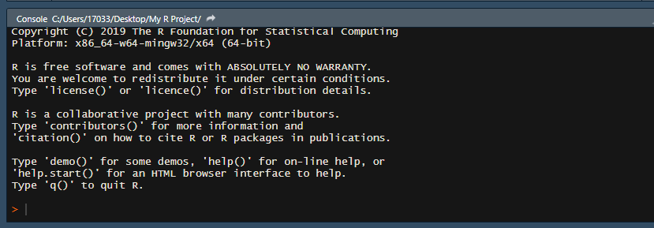
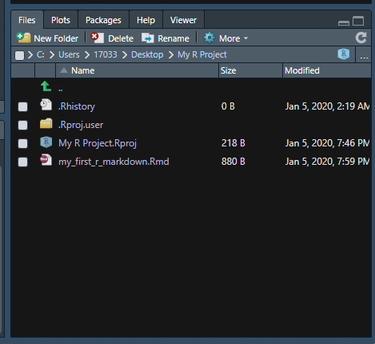

## Welcome to Intro to R Training 

The purpose of this training is to guide you through the download/installation of R, Rstudio, and Pandoc as well as a brief crash course in some of the functioniality of the program for data organization/visualization.  

To start we will download all required programs to run R readily from your personal computer. Note this tutorial will utlize Rstudio which is a set of integrated tools designed to make the usage of R more user friendly.  

_Lets Get Started!_

## Download R

First and foremost you must download R.

1. R can be downloaded at [this link](https://www.r-project.org/).  
2. Follow the **download R** link in the first paragraph of text.  
_You can select any CRAN mirror you like, just ensure it is a USA version and newer than 3.5.   (This script was developed under the Duke University mirrior)._  
3. Select the approproate download for your computer type: i.e. Windows or Mac. 

## Download Rstudio 

Next you will need to download Rstudio Desktop.

1. Rstudio Desktop can be downloaded at [this link](https://rstudio.com/products/rstudio/download/).  
_The select free version._

## Download Pandoc

Lastly, you will need to download Pandoc. Pandoc is a program that will convert your script to a Word Document. This is very helpful for quickly transferring figures and tables from Rstudio to documents and/or presentations. _Note_ Pandoc does not always directly retain the formatting from Rstudio so additional modification may be needed to size visuals properly for documents. 

1. The latest version of Pandoc can be downloaded at [this link](https://pandoc.org/installing.html).  
_Now we are ready to get started!_

# Getting to Know Rstudio

Now that we have everything installed it is time to open up Rstudio.

You should see a three-paned screen that looks similar to the image below:  
_Do not worry if you screen is a different color (I will show you how to change this later if desired). Additionally, do not worry about the file names listed in the bottom right pane (these will change based on your own computer)._  

```{r openscreen, out.height = "100%", out.width = "100%", echo=FALSE}
knitr::include_graphics("./images/rstudio_three_pane.png") 
```

## Creating a New R Project and Script

Before we delve into the function of each of the screens lets create a project that will serve as a base for your R tutorial.  
Follow the steps below:  

1. On your computer create a **new folder** on your desktop.   
    - When using Rstudio you will create _scripts_ which will be saved onto your computer (similar to the way word documents or pictures are saved). We will use this folder to save your R project as well as any accompanying scripts. 
    - Throughout this tutorial the file folder will be titled _My R Project_ (any name is appropriate however).
    
2. In Rstudio select **File**, **New Project**, **Existing Directory**, then select the _new folder_ you created in step 1.  
    - This will create a new R project in your new folder. R projects are indicated by a blue cube icon.
    - It is best to give your R files easy to identify names (i.e. avoid the usage of special characters and excessive capatilization).
    - A new Rstudio session should open your newly created R project. If your project does not open simply double click the project file _(indicated by the blue cube icon)_ to open.
    - To check which project you have open _(if any)_ in Rstudio look to the upper right-hand corner of your screen. You will see the R project cube icon with the name of the project. The image below shows an opened R project titled _My R Project_.
    
```{r proj view, out.height = "100%", out.width = "100%", echo=FALSE}
knitr::include_graphics("./images/global_environ.png") 
```
    
3. Next, we will create a new R script. In you Rstudio session _(with your project open)_ select **File**, **New File**, and **R Markdown**. Give the markdown any name you would like and select **Word** as your output. For this example, our markdown file will be called _my_first_r_markdown_. 
    - There are many different types of R scripts you can use for your analysis needs all of which have different applications. For this tutorial we will focus entirely on **Markdown or (.Rmd)** files due to their ease of understanding and ability to write extensive commentary.
    
4. Lastly, you must save your new file. Select **File** then **Save As**. Save the Markdown file with the same title you gave to the file in Rstudio (for this example I used _my_first_r_markdown_).
    - If everything was done correctly you should now see a four-paned Rstudio window that looks as below:  

```{r fourpanes, out.height = "100%", out.width = "100%", echo=FALSE}
knitr::include_graphics("./images/fourpanes.png") 
```

## The Four Rstudio Windows

Now that you are setup and ready to work in Rstudio it is first important to learn the functionality of each of the four windows. 

## The Console (bottom left)

The console is the bottom left window of your Rstudio screen and appears as below:

```{r console, out.height = "100%", out.width = "100%", echo=FALSE}
 
```

The console is the buisness end of Rstudio. All computation, functions, commands, etc. run through the console to preform the specific task they acomplish. You can type commands **directly** into the console or you can **feed** the console commands from your script tab (see below) when runing your code. 

<style>
div.blue { background-color:#e6f0ff; border-radius: 5px; padding: 20px;}
</style>
<div class = "blue">

**Try It!**  
In the console try a simple math equation such as 2 + 2.  
All direct typing into the console will start behind the **>** symbol located at the bottom left of the screen.
</div>

The console is an extremely useful tool when working in Rstudio. While you are unlikely to perform a large amount of coding directly into the console, this functionality is very helpful when troubleshooting/syntax testing to ensure your code is functional before directly entering it into your working script. 

The console also will save a history of all of the commands you have previously run for your current session. This is helpful when attempting to backtrack and/or reuse code from a previous part of your analysis. _Simply scroll up and down in the console to see all previous commands_.

**Note** any commands entred into the console will be **lost** after quitting your current R session. So if you would like to keep any code that you entered directly into the console you must copy the code to the script tab for usage later. 

## The Script Tab (top left)

While this console is the computational powerhouse of Rstudio, the script tab is the instruction manual for your R analysis. The script tab looks as below:  

```{r script tab, out.height = "100%", out.width = "100%", echo=FALSE}
knitr::include_graphics("./images/script.png") 
```

The script tab is where you will view all of your actively open R scripts. R scripts are similar to word documents in the fact that you type, modify, and save changes to the files in a similar manner however; scripts will contain a combination of plain text and coding information that allow Rstudio to perform the desired analysis tasks while also providing space for commentary. 

As mentioned above, this tutorial will be using a **Markdown** type of R script. You can think of a markdown as word document with _"chunks"_ of R code embedded into the text. Code "chunks" in markdown files will always start and end with three backticks **(```)**. All content **between** the two sets of backticks will be interpreted as code in Rstudio. These allow you to write detailed commentary to accompany specific coding aspects of your analysis for future reference. _This tutorial was created using an R Markdown script as well!_

As you complete portions of your analysis in your script tab you can click the **Run** button at the upper right of the script tab to run all or some of your script. When you run all/portions of code from your script tab you will see the commands appear in the console. Markdown files will show you the results of you code both below the specific code chunk, as well as in the console. 

<style>
div.blue { background-color:#e6f0ff; border-radius: 5px; padding: 20px;}
</style>
<div class = "blue">

**Try It!**  
In the script tab try the same math equation you ran in the console from above.  

Delete the text ```knitr::opts_chunk$set(echo = TRUE)``` from the first code chunk in the example and replace it with the math equation.  

To run the code chunk you can click the **Run** button in the upper right of the script tab or simply click the **green play** button located in the upper right hand corner of code chunk. The play button will only run the code from that specific chunk. 
</div>

We will go into a few more details of Markdown scripts a bit later on when we begin coding. 

## The Global Environment (top right)

The remaining two panes of the Rstudio screen are support components of the program. The global environment allows you to track all objects, equations, datasets, etc. that you have loaded into R or created while coding. This window looks as below:  

```{r global environ 2, out.height = "100%", out.width = "100%", echo=FALSE}
knitr::include_graphics("./images/global_environ.png") 
```

We will cover the details of the items in the coding introduction below, for now know that this pane is where these items will be stored for reference while conducting analysis. _We have not done any analysis as of yet so your global envrionment should be empty._ 

## The File Viewer (bottom right)

The last pane of the Rstudio screen is the file viewer and should look as below: 

```{r file viewer, out.height = "100%", out.width = "100%", echo=FALSE}
 
```

The file viewer allows you to view/navigate all files and folders that are currently in use by Rstudio. Since we created a new folder and R project in the early steps of this tutorial you shoud see a file view that is similar to the image above (assuming you have not added any new files since screating this folder). Think of the file viewer as a system similar to the File Explorer (Windows) or Finder (Mac). The files viewable here should be duplicates of the files you have saved directly onto your computer. 

In addition to the file viewer note the **additional tabs** in this window pane. Toggling these tabs you can switch between the **plot viewer** (this will display plots generated in the console), the **packages list** (this will list all installed and active packages in use), the **help tab** (this will display help pages for specific commands when prompted), and the **viewer tab** (this is used to view local web content). 

<style>
div.blue { background-color:#e6f0ff; border-radius: 5px; padding: 20px;}
</style>
<div class = "blue">

**Try It!**  
Toggle your file viewer to the **Packages** tab to view the packages library.     
You should see a number of listed packages that are installed (these are intrinsic to base R) usage of each package will be indicated by the presence or absence of a check mark.
</div>

# Markdown Usage Basics

Now that you are familar with the layout of Rstudio lets dig into how R Markdown scripts work for data anaylsis. As briefly described above, you can think of a Markdown as a word document that has R code embedded between pain text. All markdowns begin the a YAML header. The YAML is the multicolored text between two lines of ```---``` (pictured below).

```{r YAML, out.height = "100%", out.width = "100%", echo=FALSE}
knitr::include_graphics("./images/yaml.png") 
```

The YAML header contains important information for the markdown file related to formatting, output, as well as author/date stamps. There were **many** different setting options you can explore with Markdown and the YAML, for this tutorial we will not change any details of the YAML however you want to ensure that you **do not** delete the header when working in markdown. 


<style>
div.blue { background-color:#e6f0ff; border-radius: 5px; padding: 20px;}
</style>
<div class = "blue">

**Try It!**  
In the script tab lets begin to modify your Markdown file you created. Start by deleting everything except the YAML header. 

Beneath the YAML add some text commentary to start off you first Markdown script. Something along the lines of "This is a R Makrdown tutorial script for (your name)." Feel free to add any additional text that may be useful for you in the future. 

It is always a good idea to add lots of commentary in you analysis scripts to ensure you can replicate your results/reuse methods in the future. 
</div>

Plain text commentary is great/helpful but I assume you are using R for coding so lets work in a code chunk now. To create a new code chunk press **Control+Alt+I** (for Windows) or **Command+Option+I** (for Mac). Alternately you can use **Code** then **Insert Chunk** from the tool bar in the top left.

<style>
div.blue { background-color:#e6f0ff; border-radius: 5px; padding: 20px;}
</style>
<div class = "blue">

**Try It!**  
Create a new code chunk in your markdown script. 
</div>

**Remember** when working in a code chunk Rstudio will interpret any plain text as code. If your text is not executable syntax you will receive an error when attempting to run a chunk. However, you can tell R to ignore text within a code chunk simply by placing a **#** before the text you would like R to ignore. This functionality allows you to add commentary directly into a code chunk (which is very helpful when using complex code). 

```
a <- c(1,2,3,4,5) #The text before the # symbol is code, and this sentance is ignored as plain text.
```
When working in Rstudio different functions, text options, commands, etc. will appear as a different color on your studio screen (the specific color depends on you R theme). As you work on analysis make note of these color changes as they can help indicate the presence of a typing error if a particular part of your code is not the correct color before attempting to run a chunk.

# Libraries
The final bit of background you will need to understand before beginning to code in R is how **libraries** (sometimes called packages) function within the program. You can think of base R _(what you downloaded during installation)_ as a skeleton and all of the details and features of your specific Rstudio are the ilbraries you have loaded. Base R contain intrinsic functions (baisc math, organization commands, etc.) additional libraries expand the scope of your analysis by adding new functions, modifying existing ones, simplifying actions, etc. Libraries are free downloadable content that you install into your specific local (on you computer) R program. To use a specific library you need to _install_ it **once** however you must _load_ the library in **every** R script where you would like to use it. Typically the first code chunk in your script contains code to load all required libraries to successfully run the script. 

<style>
div.blue { background-color:#e6f0ff; border-radius: 5px; padding: 20px;}
</style>
<div class = "blue">

**Try It!**  
Let's install a library you will need for this tutorial.

We will install **tidyverse**.

In the **console** type the following syntax:
```
install.packages("tidyverse")
```
When installing multiple packages you will have to type the install.packages command for each package individually then hit enter to allow them to install.  
_Note_ some packages may take a few minutes to install (specifically tidyverse).  
_Note_ you may notice R will try to autocomplete syntax, to accept hit **enter** to ignore simply continue typing.
</div>

Now that the tidyverse is installed lets load it for use in our Markdown script. You can load a library in the script tab **or** the console. Typically you will want to include your library loading as the first code chunk in your script tab, however console usage is just fine for testing. Just be sure to remember all direct console coding will be lost at the end of your R session so be sure to move any important code/commands to the script tab and save before closing! 

<style>
div.blue { background-color:#e6f0ff; border-radius: 5px; padding: 20px;}
</style>
<div class = "blue">

**Try It!**  
Let's load in tidyverse.  
In the blank code chunk you created type the syntax below then hit the **green play** (run) button on the code chunk.
```
library(tidyverse)
```
If done correctly you should see the screen below:

```{r libs, out.height = "100%", out.width = "100%", echo=FALSE}
 
```

</div>

Many libraries will produce an information loading output as tidyverse does so there is nothing to worry about if these appear. The information in this message is important for later coding needs however, for the scope of this tutorial you will not need to worry about it. 

The library **tidyverse** is one of the most useful packages available in R. Tidyverse is actually a combination of the packages: ggplot2, tibble, tidyr, readr, purrr, dplyr, stringr, and forcats so when you use the command ```library(tidyverse)``` you actually load all of these packages. These libraries work togeather to provide coding commands for data organization, cleaning, and resturcturing (commonly referred to as _tidying_) as well as data visualization. The remainder of this tutorial will introduce R coding basics using Base R and Tidyverse commands. 

_It should be noted_ that the scope of this tutorial will cover only a very small portion of all the functionality of Base R and Tidyverse and is designed primairly to intorduce the flow of R coding rather than specific commands. Additionally, most functions in R can be acomplished through multiple different coding syntaxes so the structure presented here is by no means the only way to acomplish specific tasks. 

I encourage you to learn as many commands as possible to expand your knowledge of R!

# Coding Crash Course

From this point onward all coding 


To Do


Coding Intro
    objects
    classes
    basic commands
    tidyverse
    ggplot
